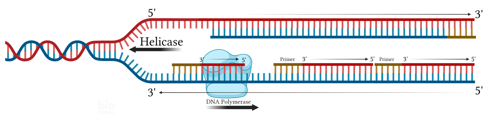

# Chapter 10: DNA Structure and Replication

# DNA

### DNA Overview

**DNA** is a macromolecule that stores genetic information.

- In eukaryotes, DNA is in the nucleus.
- Prokaryotes lack a nucleus. Their DNA is in the nucleoid region of the cytoplasm.

### Nucleic Acids

**Nucleic Acids:**

- DNA and RNA are nucleic acids.
- Nucleic acids are polymers, composed of **nucleotide** monomers.

**Nucleotide:**

- Nucleotides have three components:
    - Pentose sugar monosaccharide
        - **Deoxyribose** in DNA (deoxyribonucleic acid)
        - **Ribose** in RNA (ribonucleic acid)
            - Ribose has a hydroxyl on carbon 2'; deoxytibose has a hydrogen
    - Phosphate group
    - Nitrogenous base

**Nucleotide Types:**

- There are four types of DNA nucleotides and four types of RNA nucleotides.
- Among the four DNA nucleotides, all share the same phosphate group and pentose sugar, but differ in the nitrogenous base. Similarily, the four RNA nucleotides have the same phosphate grop and pentose sugar but different nitrogenous bases.
- DNA and RNA share three of their four bases, and differ in the fourth.
- Both have:
    - **A (Adenine)**
    - **C (Cytosine)**
    - **G (Guanine)**
- DNA has:
    - **T (Thymine)**
- RNA has:
    - **U (Uracil)**
  
### Polymerization

**Polynucleotide:** Polymer chain of multiple nucleotides 

- To form DNA and RNA polymers, the phosphate of one nucleotide bonds with the sugar of the next in a **phosphodiester bond**
- The sugars and phosphates form the polynucleotide **backbone.** The nitrogenous bases extend from the backbone.
- The specific sequence of nitrogenous bases is what stores the DNA and RNAs’ information.

**Polymerization Directionality:**

- Phosphate groups attach to the 5’ carbon of the first nucleotide’s sugar and the 3’ carbon of the next.
- The first nucleotide in the chain has a phosphate attached to its 5’ carbon but not to its 3’ carbon. This is called the “5’ end”.
- The last nucleotide in the chain has a phosphate attached to its 3’ carbon but not to its 5’ carbon. This is called the “3’ end”.
- Polynucleotides are only polymerized in one direction - from the 5’ end to the 3’ end, each time linking a new sugar’s 3’ carbon to the previous sugar’s 5’ carbon.

### Structure

**Polynucleotide:**

- The polynucleotide backbone twists into a helix-like structure due to various chemical reasonings

**DNA:**

- DNA has a second polynucleotide chain which runs parallel to the first in the opposite direction; it has an opposite 5’ and 3’ end
- The nitrogenous bases of the two chains form hydrogen bonds with each other, creating a **double-helix** structure
- Each nucleotide type will only bond with a specific opposing nucleotide type; the parallel strands must be perfectly oppositely matched
    - A and T bond
    - C and G bond

### Chromosome

**Eukaryotic Chromosome Organization:**

- The DNA polynucleotide chain wraps around **histone** proteins.
    - Each DNA-histone loop is a **nucleosome**
- Nucleosomes coil into **chromatin fiber**
- During interphase, the chromatin is loose and messy, and individual chromosomes are not visible. By prophase, the chromatin condenses to defined, visible chromosome structures.

---

# DNA Replication

### Overview

**DNA Replication:**

- Prior to cell division, the DNA is replicated
    - In Eukaryotes, this happens in the ‘S’ phase of the cell cycle interphase
    - In prokaryotes, this happens prior to binary fission

**Semiconservative Model:**

- Each new molecule of DNA contains one strand from the original molecule, and one new strand.
- The two original DNA strands are unwound and unattached. Each strand then serves as a template for a new strand, which is composed of bases that pair with the original strand.

### DNA Replication Enzymes

**DNA Helicase:**

- Unwinds the DNA double helix and separates the two strands

**Topoisomerase:**

- Helps the DNA unwind by releasing tension by creating temporary gaps

**DNA Polymerase**:

- Synthesizes the new DNA strand by adding nucleotides based on base pairing with the original strand
- Cannot initiate a new DNA strand; requires an RNA primer, to which it can add nucleotides.
- Unidirectional; only adds on to the 3’ end - attaches a new nucleotide’s 5’ end to the previous nucleotide’s 3’ end
- Also proofreads and error-corrects

**Primase:**

- Places the RNA primer

**Ligase:**

- Joins Okazaki fragments

### Okazaki Fragments

- The two strands of DNA run in opposite directions:
    
    
    
    When the helicase unzips the two strands, one is exposed from its 5’ end to its 3’ end, running in the direction of the helicase movement, while the other is exposed from its 3’ end to its 5’ end, running in the opposite direction of the helicase movement.
    
    
    
- The new strand of DNA will run in the opposite direction its paired original strand.
    
    The new strand paired with the original strand running in the direction of the helicase movement will run in the opposite direction of the helicase movement; the new strand paired with the original strand running in the opposite direction of the helicase movement will run in the direction of the helicase movement.
    
- The new strand which runs in the direction of the helicase movement can immediately begin synthesis as soon as its paired strand is exposed.
    
    
    
    It can be continuously synthesized, in the direction of the helicase movement, with a single initial primer.
    
    
    
- However, the strand running in the opposite direction of the helicase movement cannot immediately begin synthesis.
    
    Instead, it waits until an adequate segment of the original strand is revealed. It then places a primer and is synthesized in the opposite direction of the helicase movement, towards the origin of its paired exposed strand.
    
    
    
    To continue synthesis further down in the direction of the helicase movement, a new primer must be placed once an additional adequate segment of original DNA is exposed, from which the new strand can be synthesized in the opposite direction of the helicase movement, towards the previously placed primer.
    
    
    
    This results in multiple fragments of new DNA, called **Okazaki fragments**.
    
    
    
- The continuously synthesized strand, which runs in the direction of the helicase movement, is the **leading strand.**
    
    The discontinuously synthesized strand, which runs in the opposite direction of the helicase movement, is the **lagging strand.**
    
- Eventually, the RNA primers are removed and replaced with DNA nucleotides. Ligase then joins the fragments by catalyzing phosphodiester linkages between the terminals, creating a single continuous strand.

### Origin of Replication

**Bidirectional Replication:**

- DNA replication begins at a single point and moves in both directions.
- The expanding unwound portion is the **replication bubble**.
- Each direction has a leading strand and a lagging strand.
    
    
    

**Prokaryotes:**

- Prokaryotes have a single circular DNA molecule.
- In prokaryote DNA replication, there is a single replication bubble.

**Eukaryotes:**

- Eukaryotes have numerous linear DNA chromosomes
- Eukaryote replication has multiple origins, with multiple replication bubbles.

---

# Schematics

- **DNA Structure: see chapters 3 and 4**

### Replication models

- **Conservative**
    
    
    
- **Semi Conservative**
    
    
    
- **Dispersive**
    
    
    

### DNA Replication

- **Overall structure**
    
    
    
    
    
    
    

### Okazaki Fragments

- **Overview**
    
    
    
- **Reverse parallel DNA strands**
    
    
    
- **Primase**
    
    
    
- **Leading / lagging strands**
    
    
    
- **Ligase**
    
    
    
- **Final product**
    
    
    

### Prokaryotic DNA Replication

