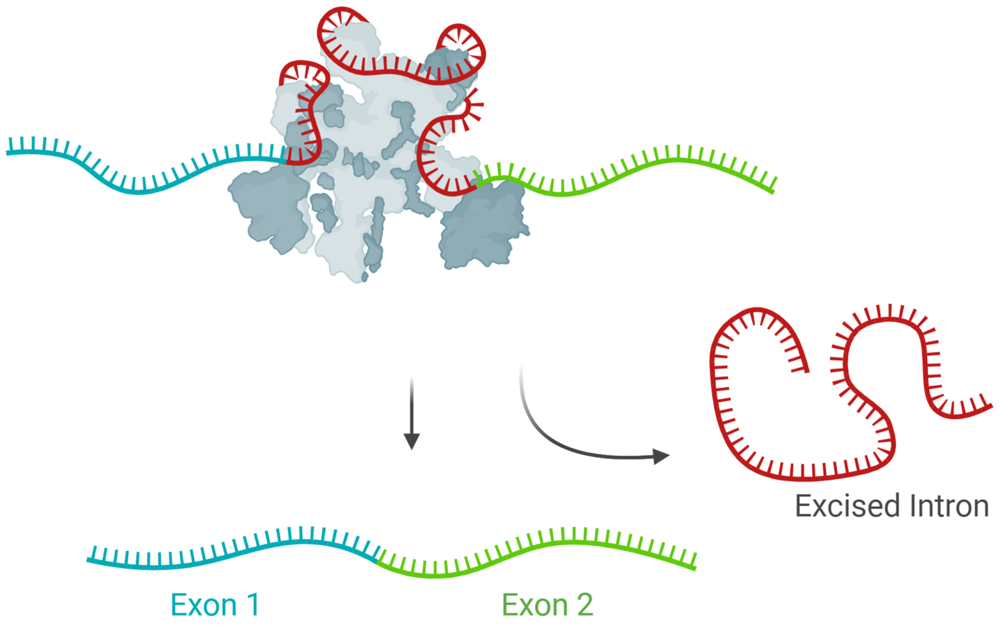
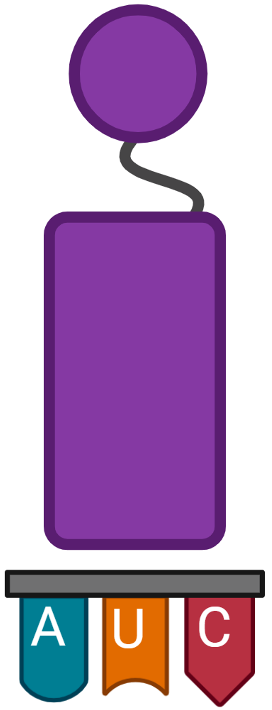
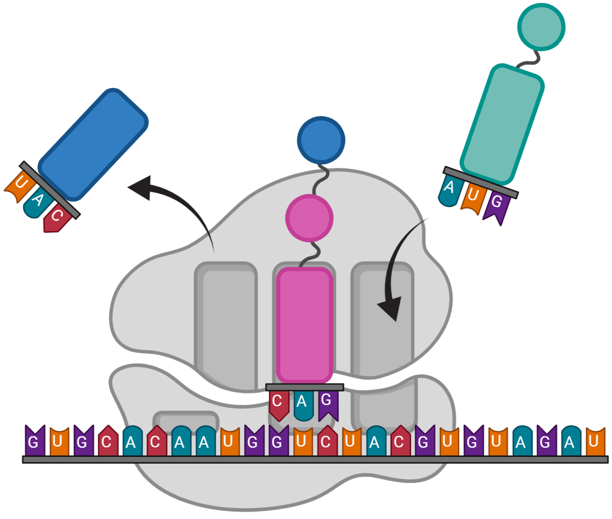

# Chapter 11: From DNA to Protein

# Overview

### Central Dogma of Life

The central dogma of life describes the sequence by which genetic instructions in the DNA is ultimately carried out by the cell:

$$
DNA \to mRNA \to Protein
$$

- Genetic information is stored in the DNA
- Genetic information in the DNA is transcribed to mRNA - “Transcription”
- Genetic information in mRNA is translated into proteins - “Translation”
- Proteins perform cellular functions

---

# RNA

### RNA

**RNA:**

- RNA is a nucleic acid
- Nucleic acids are polymers, made of nucleosome monomers
    - RNA is made from four types of nucleosomes:
        - **`A` (Adenine)**
        - **`C` (Cytosine)**
        - **`G` (Guanine)**
        - **`U` (Uracil)**
            - DNA is made of `A`, `C`, `G` and `T` (Thymine)
- Unlike DNA, which is double stranded, RNA is single stranded
- RNA is synthesized in the nucleus by **RNA polymerase**

### Types of RNA

There are three types of RNA:

- **mRNA**:
    - Messenger RNA
    - Carries the genetic information from the DNA to ribosomes
- **tRNA**:
    - Transfer RNA
    - Brings amino acids to the ribosome for protein synthesis
- **rRNA:**
    - Ribosomal RNA
    - Make up ribosome, along with proteins
    - Synthesized in the nucleolus

---

# Transcription

### Transcription, mRNA Synthesis

**Transcription:**

- mRNA is synthesized by RNA polymerase.
- The RNA polymerase unwinds the DNA and synthesizes RNA from nucleic acids that base-pair with the DNA, transcribing the DNA sequence to the RNA

### mRNA Modification

mRNA undergoes modification before it leaves the nucleus for the ribosomes.

- One such modification is **mRNA splicing**.
    - DNA contains **introns** - segments - which do not code for protein and are not part of the gene expression.
    - When the mRNA is initially synthesized, the introns are included.
    - During mRNA splicing, the introns are removed, and the remaining **exons** - coding portions - are reattached together.

---

# Translation

### Protein, Ribosomes

Protein:

- Proteins are polymers made of amino acid monomers.
- There are 20 types of amino acids. The specific sequence of amino acids is what gives each protein its unique identity and properties.
- Protein synthesis takes place in ribosomes, which are in the cytoplasm.

Ribosomes:

- Ribosomes are made of rRNA and protein.
- Ribosomes are initially assembled in the nucleus.
- Ribosomes have two parts - the large subunit and the small subunit.

### Codons, tRNA, Translation

**Codons:**

- Codons are sets of three nucleic acid bases.
- Each codon specifies a specific amino acid.
- The amino acid which is specified in the mRNA codon is added to the polypeptide chain, translating the mRNA information into protein.

tRNA:

- tRNA is used to bring amino acids to the ribosomes, and to translate the mRNA codon to its respective amino acid.
- tRNAs have an **anticodon**, which base pairs with the mRNA, and a specific amino acid for each anticodon.
- The mRNA codon will only pair with the corresponding tRNA, which in turn adds its amino acid to the polypeptide chain.

Example:

- `GCA` codes for Alanine:
    - To result in an alanine amino acid, the DNA codon will be `CGT`.
    - The corresponding mRNA is `GCA`.
    - The tRNA with the anticodon `CGU` carries alanine.

### Codons

- As there are 64 possible codons ($4 \times 4 \times 4$) and only 20 amino acids, numerous codons code for similar amino acids.
- `AUG` is the **start codon**; mRNA strands start with `AUG`. It translates to Methionine.
- Several codons are the **stop codons**. They do not translate to an amino acid.

---

# Prokaryotes vs Eukaryotes

There are several differences between prokaryotic and eukaryotic transcription and translation:

- Eukaryotes:
    - The DNA is in the nucleus. Transcription takes place in the nucleus; translation takes place afterwards in the cytoplasm.
    - mRNA undergoes modification
    - Each mRNA only codes for one protein
- Prokaryotes:
    - There is no nucleus; transcription and translation take place in the cytoplasm, simultaneously.
    - mRNA is not modified.
    - One mRNA can code for multiple proteins.

---

# Schematics

### Central Dogma of Life

- **Overview**
    - DNA → RNA → Polypeptide chain → Folded protein
        
        
        
- **Detailed**
    
    
    

### Transcription

- **Transcription**
    - RNA Polymerase unwinds DNA and synthesizes mRNA:
        
        
        

### Splicing

- **Overview**
    
    
    
- **pre-mRNA**
    
    
    
- **mRNA splicing**
    
    
    

### Translation

- **Amino acids**
    
    
    
- **mRNA codons**
    
    
    
- **Codon table**
    
    
    
- **Codon wheel**
    
    
    
- **Translation; overview**
    - mRNA is translated by the ribosome to polypeptide chains:
        
        
        
- **tRNA**
    
    
    
- **Translation; detailed**
    
    
    

---
