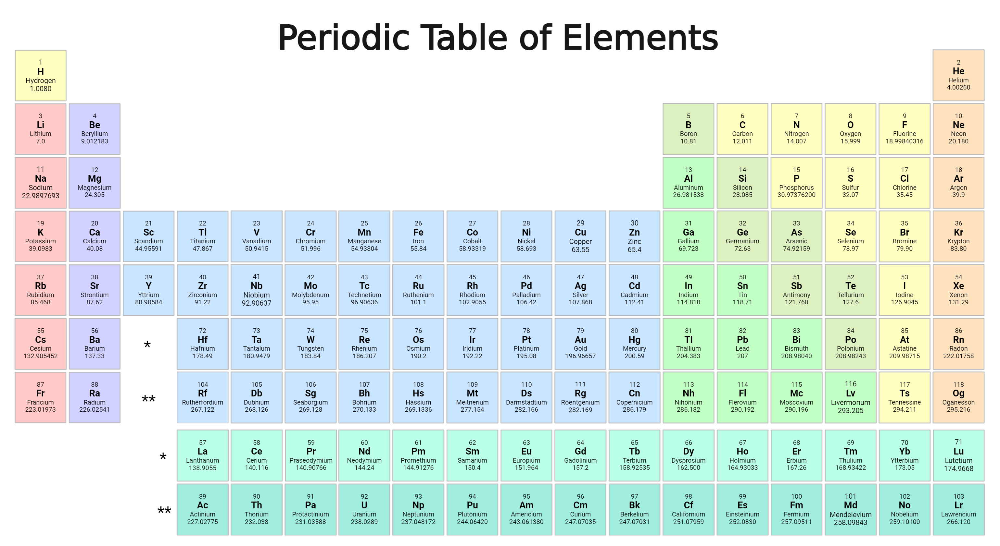

# Chapter 2: Chemistry of Life

# Chemistry

### Atoms; Subatomic Particles

- **Atoms:** Most basic unit of matter. Composed of protons, neutrons and electrons.
    - **Nucleus:** Located in the center of an atom. Contains protons and neutrons.
        - **Proton:** Positively charged subatomic particle; located in nucleus
        - **Neutron:** Neutrally charged subatomic particle; located in nucleus
        - **Electron:** Negatively charged subatomic particle; orbits nucleus

### Element

**Element:**

- Simplest substance
- An atom is the smallest entity that has all characteristics of an element

### Number of Subatomic Particles

**Protons:**

- An element’s **atomic number** is its number of protons in its atoms
- Each element has a unique number of protons; the number of protons is what gives each element its unique properties

**Electrons:**

- An element naturally has an equal number of protons and electrons, making its total charge neutral.

**Neutrons:**

- An element can have a varied number of neutrons.
- **Isotope:**
    - Specific variation of an element based on its neutron count

**Atomic Mass:**

- An individual atom’s mass is the tally of its protons and neutrons
- As atoms of an element have isotopes with varied numbers of neutron, they do not have identical masses
- **Atomic Mass:**
    - An element’s average mass based on the natural distribution of its isotopes

### Periodic Table

**Periodic Table:**

- Lists the elements
    
    
    
- Legend:
    
    
    
    - Atomic number: 6
    - Element: Carbon
    - Symbol: `C`
    - Atomic mass: 12.011

### Electrons

**Orbitals:**

- Electrons orbit the nucleus
- Electrons are located in orbitals - regions within which the electron can be located
- There are multiple **orbital shell / energy levels** among which electrons are distributed
    - **Valence Shell:** Outermost shell

**Octet Rule:**

- Atoms are most stable when their valence shell is complete with eight electrons
    - (aside from the innermost shell, which is complete with only two electrons).
- Atoms will donate, accept or share electrons to complete their valence shell.
- This is the underlying principle behind much of chemistry.

**Noble Gasses:** Elements with naturally full valence shells

### Chemical Compounds

**Chemical Compound:**

- Atoms of different elements chemically bound to each other

**Molecule:**

- Most basic unit of a chemical compound

### **Ionic Bond**

**Ionic Bond:**

- In an ionic bond, an atom with extra valence electrons transfers them to an atom with missing valence electrons, completing both atoms’ valence shells
    - **Electron Transfer:** Transfer of electrons from one atom to another
- Each atom is now an **ion:** an atom with an uneven amount of protons and electrons
    - **Cation:** Ion which lost an electron; is now positive
    - **Anion:** Ion which gained an electron; is now negative
- As one ion is positive and one negative, they attract and bond, forming an **ionic bond**  - the bond between ions
    - Example of ionic bond: Sodium Chloride

### Covalent Bond

**Covalent Bond:**

- In a covalent bond, instead of transferring the electron, a pair of electrons - one from each atom - is shared, making them covalent electrons - valence electrons of both atoms

**Polar Covalent Bond:**

- If one of the atoms has more **electronegativity** (the amount of attractive pull an atom has to electrons) than the other, it will attract the shared electrons more than the other, making the bond **polar**
    - Example of covalent bond: H2O

### Acids, Bases

**Acids:**

- Substances that release positive hydrogen ions (H+) into a solution

**Bases:**

- Substances that release negative hydroxide ions (OH-) into a solution or absorbs hydrogen ions

**pH scale:**

- Measures the acidity of a solution on a scale of 0 - 14
    - < 7: Acid
    - = 7: Neutral
    - \> 7: Basic

**Buffers:**

- Keep a system pH neutral by absorbing excess hydrogen and hydroxide ions

### Chemical Reactions

**Chemical formula:**

- Describes the makeup of a molecule, such as “H2O”

**Chemical reaction:**

- Process of atoms bonding, or atomic bonds being broken

**Reactants:**

- The substances that undergo a chemical reaction

**Products:**

- The product of a chemical reaction

**Reversible chemical reaction:**

- Chemical reaction that can go both ways; the product can turn back into the reactants
    - **Equilibrium:**
        - When the reactants and products in a reversible chemical reaction reach a balanced state and stop changing back and forth

**Irreversible chemical reaction:**

- Chemical reaction that can only go one way

**Balanced chemical equation:**

- Chemical reaction with an equal number of atoms on both sides

**Anabolic** **pathway:**

- Chemical reaction in which smaller molecules bond to form larger ones.
- Takes energy.

**Catabolic** **pathway:** 

- Chemical reaction in which larger molecules break into smaller ones.
- Releases energy.

### Intermolecular Bonds

**van der Waals interactions:**

- Due to their non-uniform electronegativity, molecules may attract each other

**Hydrogen bonds:**

- Water is extremely polar, due to oxygen’s high electronegativity, causing water to form strong bonds with other polar molecules, called hydrogen bonds
    - Water properties due to hydrogen bonds:
        - **Cohesion:**
            - Forms bonds with itself
        - **Adhesion:**
            - Forms bonds with surfaces
        - **Surface tension**
        - **High heat capacity, high heat evaporation**
        - **Universal solvent:**
            - Breaks other bonds apart
            - **Solvent:**
                - Something that dissolves **solutes**, forming a **solution**
        - **Ice:**
            - Hydrogen bonds cause ice to be less dense than water
            - The molecules’ polarity causes it to form a gap-filled grid-like structure

**Hydrophilic:**

- Polar molecules that are attracted to water

**Hydrophobic:**

- Nonpolar molecules that are repelled by water

---

# Chemistry of Life

### Basic Elements of Life

Basic elements of life:

- **Carbon**
- **Hydrogen**
- **Nitrogen**
- **Oxygen**
- **Phosphorus**
- **Sulfur**

### Organic Molecules

**Carbon:**

- Life is based around carbon due to carbon’s versatility in binding to other atoms and itself due to its four available valence electrons

**Organic:**

- `Organic molecules` are molecules with a carbon base that contain carbon and hydrogen

### Functional Groups

**Functional groups:**

- Groups of atoms within larger life molecules that serve a particular function
    - Common functional groups include **hydroxyl, methyl, carbonyl, carboxyl, phosphate, amino**

---

# Schematics

### Chemistry

- **Atom**
    
    
    
- **H2O**
    
    
    
- **Electron Transfer**
    
    
    
- **Covalent Bond**
    
    
    
- **pH Scale**
    
    
    

### Biology

- **Functional Groups**
    - **Alkane**
        - Hydrocarbon molecule
        - Consists of only carbon and hydrogen
        - Only contains single carbon bonds
            
            
            
    - **Alkene**
        - Hydrocarbon molecule / functional group
        - Contains a *double* carbon bond
            
            
            
    - **Alkyne**
        - Hydrocarbon molecule / functional group
        - Contains a *triple* carbon bond
            
            
            
    - **Methyl**
        - Functional group
        - Carbon bonded to three hydrogens
            
            
            
    - **Hydroxyl**
        - Functional group
        - OH
            
            
            
    - **Alcohol**
        - Functional group
        - Hydroxyl attached to a carbon
            
            
            
    - **Ether**
        - Functional group
        - Oxygen attached to two carbons
            
            
            
    - **Carbonyl**
        - Functional group
        - Carbon double bound to oxygen
        - **Ketone**
            - Carbonyl in the middle of a carbon chain
                
                
                
        - **Aldehyde**
            - Carbonyl at the end of a carbon chain
                
                
                
    - **Ester**
        - Functional group
        - Carbonyl attached to an oxygen which is part of an $r$ group
        
        
        
    - **Carboxyl**
        - Functional group
        - Carbonyl attached to an oxygen which is part of a hydroxyl group
            
            
            
    - **Amino**
        - Functional group
        - Nitrogen bonded to two hydrogens
            
            
            
    - **Phosphate**
        - Functional group
        - Phosphate bonded to four oxygens; three single bonds, one double bond
            
            
