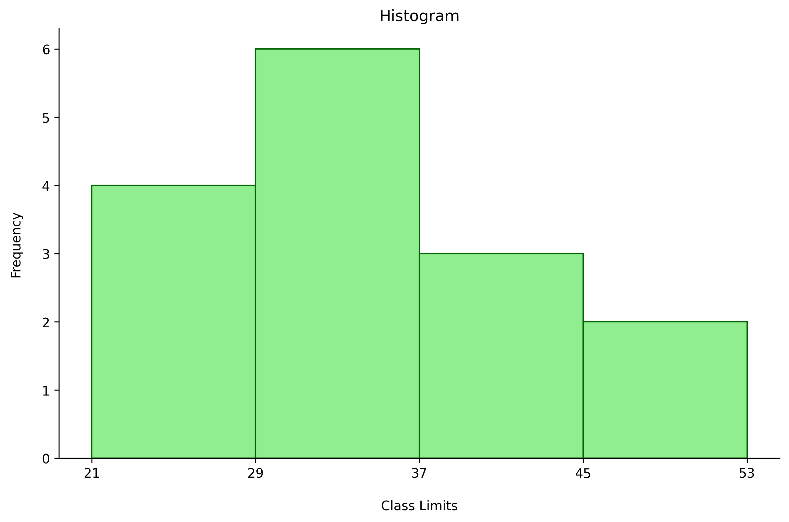

# Chapter 2: Frequency Distribution and Graphs

# Organizing Data

### Raw Data

**Raw Data**: Unprocessed data

Example: Study of colors of cars in a lot; the raw data is the list of colors

| red |
| --- |
| blue |
| blue |
| white |
| black |
| blue |
| white |
| red |
| orange |
| white |

For data to be useful, it must be organized.

### Frequency Distribution

**Frequency Distribution:** Organizes raw data by showing the distribution of each class’s frequency 

**Class:** Category data is placed in

**Frequency:** Number of times data within a class appears in a dataset

Example: The above car-color data can be placed in the following frequency distribution:

| Class | Frequency |
| --- | --- |
| red | 2 |
| blue | 3 |
| white | 3 |
| black | 1 |
| orange | 1 |
| TOTAL: | 10 |

### Types of Frequency Distributions

- **Categorical Frequency Distribution:** Places data in individual qualitative classes
    
    Example: Car color
    
- **Grouped Frequency Distribution:** Places data in grouped classes; generally ranges of values for quantitative data
    
    Example: Ages of students in a class
    
    Raw data:
    
    | 22 |
    | --- |
    | 31 |
    | 29 |
    | 29 |
    | 27 |
    | 21 |
    | 24 |
    | 18 |
    | 21 |
    | 33 |
    
    Grouped Frequency Distribution:
    
    | Class | Frequency |
    | --- | --- |
    | 18-21 | 3 |
    | 22-25 | 2 |
    | 26-29 | 3 |
    | 30-33 | 2 |
    | TOTAL | 10 |
- **Ungrouped Frequency Distribution:** Used for a small range of quantitative values; instead grouping values into classes, each is its own class
    
    Example: Age of students in a class
    
    Raw data:
    
    | 22 |
    | --- |
    | 21 |
    | 19 |
    | 19 |
    | 18 |
    | 21 |
    | 20 |
    | 18 |
    | 21 |
    | 20 |
    
    Ungrouped Frequency Distribution:
    
    | Class | Frequency |
    | --- | --- |
    | 18 | 2 |
    | 19 | 2 |
    | 20 | 2 |
    | 21 | 3 |
    | 22 | 1 |
    | TOTAL: | 10 |

### Class Details

**Class Limits**: Range of values included in class

- **Lower Class Limit:** Lowest value included in class
- **Upper Class Limit:** Highest value included in class
    
    Example: “18-21”
    
    - “18-21” is the class limit
    - “18” is the lower class limit
    - “21” is the upper class limit

**Class Boundaries:** Specifies the range of values which are rounded to the class; fills the gap between a class’s upper limit and the lower limit of the next class

Example: Distance, in miles

| Class Limits | Class Boundaries | Frequency |
| --- | --- | --- |
| 3-5 | 2.5-5.5 | 3 |
| 6-8 | 5.5-8.5 | 6 |
| 9-11 | 8.5-11.5 | 2 |
| 12-14 | 11.5-14.5 | 5 |

- Unlike class limits, where the upper class limit of a class is one less than the lower class limit of the next, the upper class boundary of a class is equal to the lower class boundary of the next
- Class limits should contain the same number of decimals as the data; class boundaries should contain one more, and generally end in a 5
- Class boundaries should be halfway between the lower class’s upper limit and the higher class’s lower limit

**Class Width:** Width of class range

- To calculate, subtract a class’s lower limit from the next class’s lower limit
- Alternatively, subtract a class’s lower boundary from the class’s upper boundary
- Note: Do not subtract a class’s lower limit from the class’s upper limit

**Class Midpoint (**$X_m$)**:** Midpoint of class range

- To calculate, find the average of the class limits, or the class boundaries
    
    Example:
    
    - Class: “3-5”
    - Class Midpoint: “4”

### Creating Grouped Frequency Distributions

Guidelines:

- Classes should be mutually exclusive
- Classes should be continuous
- Classes should include all the data
- Classes should be of equal length
    - Other than first or last **open-ended class** in an **open ended distribution**

Procedure:

1. Find the lowest and highest data values.
2. Find the range of values by subtracting the lowest value from the highest.
3. Divide the value range by the desired number of classes.
    
    Note: There are numerous algorithms for finding the optimal number of classes for a data set.
    
4. If the result is not a whole number, round up.
5. This is the class width.
6. The first class’s lower limit is the lowest value.
7. The second class’s lower limit is the first class’s lower limit plus the class width.
8. The first class’s upper limit is the second class’s lower limit minus one.
    
    Example:
    
    Raw data:
    
    | 22 |
    | --- |
    | 31 |
    | 29 |
    | 29 |
    | 27 |
    | 21 |
    | 24 |
    | 18 |
    | 21 |
    | 33 |

    1. Lowest value: 18. Highest value: 33.
    2. Range of values: 15
    3. Desired number of classes: 4.
    4. $\lceil \frac {15} {4} \rceil$ = 4
    5. Class width: 4
    6. First class lower limit: 18
    7. Second class lower limit: 22
    8. First class upper limit: 21

### Cumulative Frequency Distribution

**Cumulative Frequency Distribution**: Shows frequency of all values ≤ a certain value; generally a class’s upper boundary

Example:

| Class Limits | Class Boundaries | Frequency | Cumulative Frequency |
| --- | --- | --- | --- |
| 3-5 | 2.5-5.5 | 3 | 3 |
| 6-8 | 5.5-8.5 | 6 | 9 |
| 9-11 | 8.5-11.5 | 2 | 11 |
| 12-14 | 11.5-14.5 | 5 | 16 |

# Histograms, Frequency Polygons, and Ogives

### Histogram

**Histogram**: Graphs a frequency distribution with continuous vertical bars

Example:

| 24 |
| --- |
| 25 |
| 49 |
| 26 |
| 31 |
| 32 |
| 21 |
| 29 |
| 40 |
| 30 |
| 29 |
| 47 |
| 43 |
| 36 |
| 41 |

Frequency Distribution:

| 21-28 | 4 |
| --- | --- |
| 29-36 | 6 |
| 37-44 | 3 |
| 45-52 | 2 |

Histogram:

### Frequency Polygon

**Frequency Polygon:** Graphs a frequency distribution by plotting the class midpoint by the class frequency

Example:

### Ogive

**Ogive:** Plots the cumulative frequency of values below the class upper boundaries

Example:

### Relative Frequency

**Relative Frequency:** A class’s frequency as a percentage of the total number of values

Example:

| Class | Frequency | Relative Frequency |
| --- | --- | --- |
| 21-28 | 4 | 0.267 |
| 29-36 | 6 | 0.4 |
| 37-44 | 3 | 0.2 |
| 45-52 | 2 | 0.133 |

### Distribution Shapes

The shape of a frequency distribution graph can reveal information about the distribution.

- **Bell Shaped:**
    
    
    
- **Uniform:**
    
    
    
- **Right Skewed:**
    
    
    
- **Left Skewed:**
    
    
    
- **Bimodal -** has two peaks:
    
    
    

# Other Types of Graphs

### Bar Graph

Example:

**Compound Bar Graph:** Compares data from two groups

Example:

### Pie Graph

Example:

### Dot Plot

**Dot Plot:** Plots a frequency distribution by displaying the corresponding number of dots above each value

Example:

### Stem and Leaf Plot

**Stem and Left Plot:** Displays all the data, arranged into stems of leading digits and leaves of trailing digits

Example:

Raw data:

| 25 |
| --- |
| 31 |
| 20 |
| 32 |
| 13 |
| 14 |
| 43 |
| 02 |
| 57 |
| 23 |
| 36 |
| 32 |
| 33 |
| 32 |
| 44 |
| 32 |
| 52 |
| 44 |
| 51 |
| 45 |

Stem and leaf plot:

